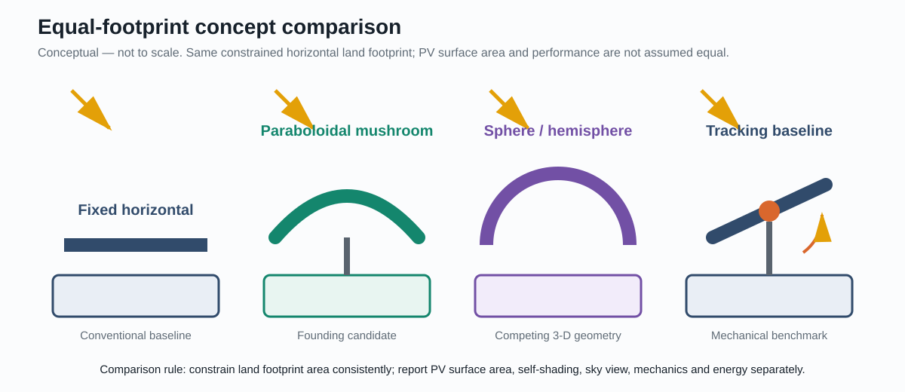
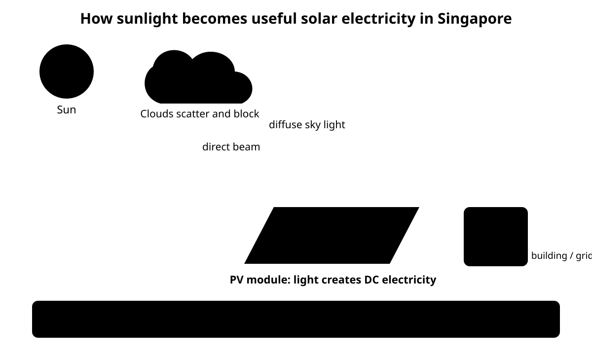
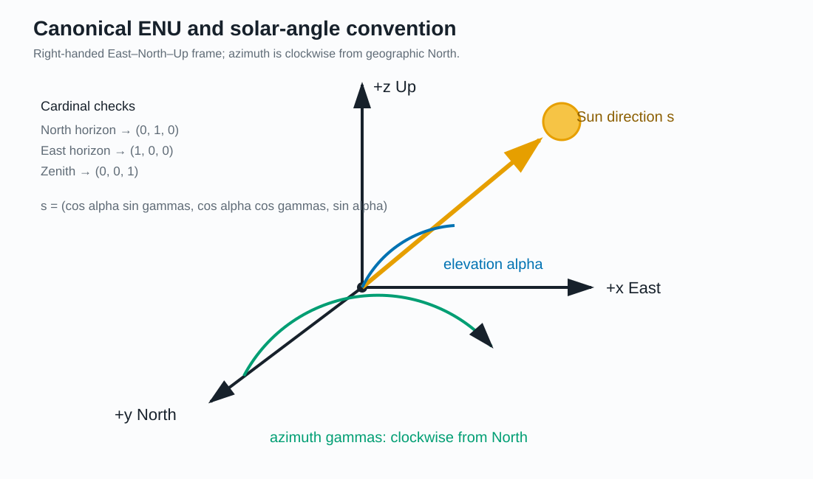
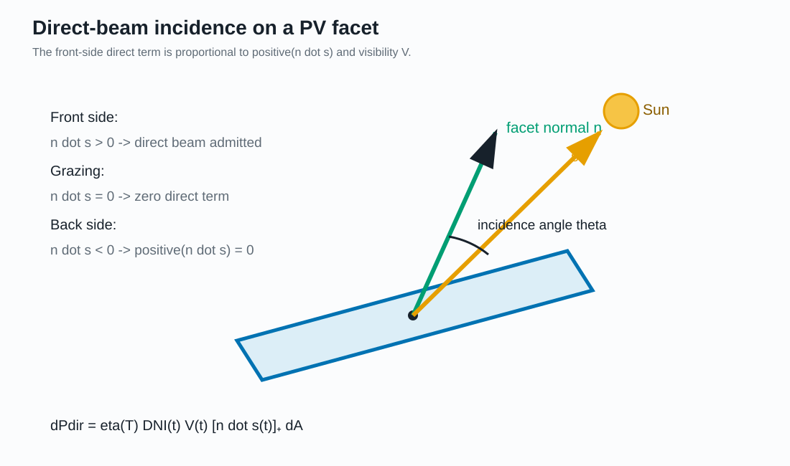
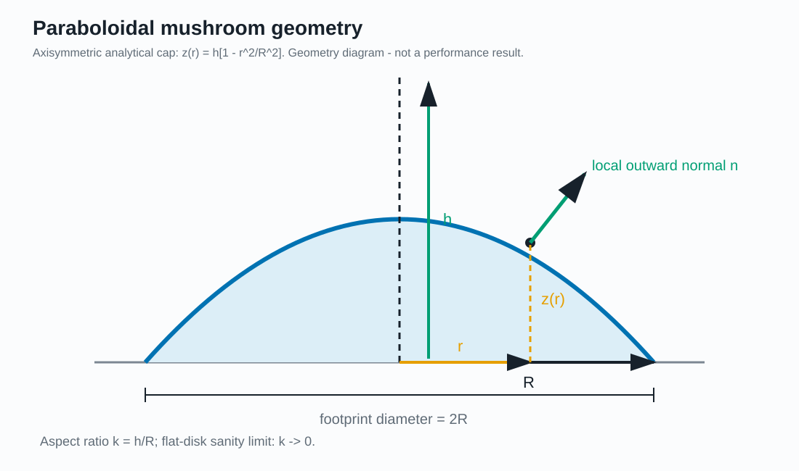
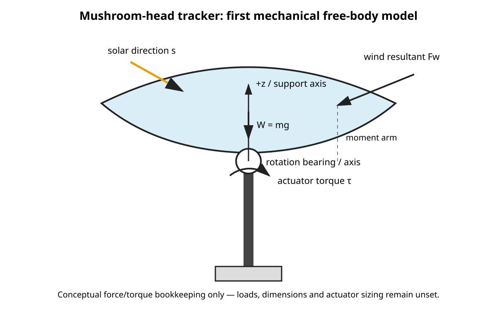
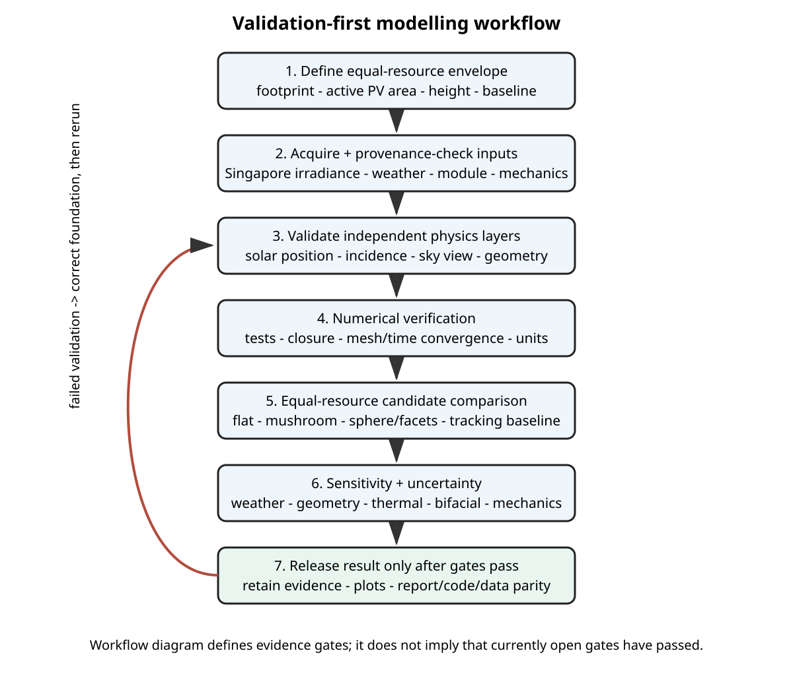

# Topology and Geometry Optimisation of Three-Dimensional Photovoltaic Canopies for Land-Constrained Singapore

**Status:** Foundation reconstruction and analytical benchmarks — no validated Singapore performance result  
**Date:** 23 September 2026

## Abstract
Singapore's solar resource is strong but deployment is constrained by scarce land and competing urban uses. This project investigates whether three-dimensional photovoltaic (PV) geometries—initially motivated by a rotating "mushroom-head" panel—can increase annual electricity generation per constrained horizontal footprint. Curvature does not create solar energy; its possible value is spatial packing. A 3-D canopy can place $A_{\mathrm{PV}}>A_{\mathrm{land}}$ while attempting to retain irradiation quality, bifacial access, ventilation and useful space below. Early numerical results are deliberately idealised and are not bankable yield predictions.

## 1. Problem and motivation
The engineering question is: **for a constrained horizontal footprint in Singapore, what 3-D PV geometry and movement strategy maximises useful annual energy and lifecycle value after optical, thermal, mechanical, structural and economic penalties are included?**

External Singapore values are maintained in the project provenance register and bibliography rather than treated as unexplained constants.

### 1.1 From sunlight to a geometry problem

Before introducing vectors, it is useful to separate the physical chain that the model is trying to represent. At a given instant, the atmosphere supplies irradiance. **GHI** is the total short-wave irradiance on a horizontal plane; **DNI** is the direct beam measured on a plane normal to the Sun; and **DHI** is the diffuse irradiance received by a horizontal plane from the sky. For a horizontal unobstructed receiver these quantities obey the familiar closure relation

$
GHI = DNI\,\sin\alpha + DHI,
$

where $\alpha$ is solar elevation. This equation is a useful measurement/model consistency check, not a complete transposition model for an arbitrarily oriented PV surface.

A three-dimensional PV geometry changes what happens *after* the atmospheric irradiance field is specified. Each small surface element has an orientation represented by its outward normal $\mathbf n$. The Sun has a direction represented by $\mathbf s$. Their dot product determines the cosine projection of the direct beam:

$
\cos\theta_i=\mathbf n\cdot\mathbf s,
$

where $\theta_i$ is the incidence angle between the surface normal and the direction to the Sun. For a monofacial surface, negative values do not illuminate the front face, hence the later use of $[\mathbf n\cdot\mathbf s]_+$.

Orientation alone is insufficient. Another part of the canopy may block the direct ray, so the model also needs a visibility term $V$. Diffuse radiation requires a sky-view model because a tilted or crowded facet may see only part of the sky. Received irradiance is then converted to electrical power using a PV efficiency model, with later corrections for temperature, bifacial response, mismatch and system losses.

The complete logic used throughout this project is therefore

$
\boxed{
\text{weather}
\rightarrow
\text{Sun position}
\rightarrow
\text{surface orientation}
\rightarrow
\text{visibility/sky view}
\rightarrow
\text{received irradiance}
\rightarrow
\text{electrical energy}
\rightarrow
\text{land-normalised comparison}
}
$

This chain explains why a curved surface cannot be judged from surface area alone. Adding PV area can increase the packing ratio, but every added element must still receive useful irradiance. The optimisation problem is consequently a competition between **more active area per unit land** and **lower average productivity of that packed area**. Sections 2--7 build those quantities from first principles before any candidate geometry is compared.

### 1.2 Concept and model-flow diagrams

**Figure 1.** Equal-footprint project concept. The purpose of the three-dimensional geometry is not to claim improved cell efficiency, but to test whether additional active PV can be packed into scarce horizontal footprint without losing too much irradiation quality or introducing unacceptable mechanical and lifecycle penalties.

**Figure 2.** Beginner-to-model bridge from Singapore solar resource to facet irradiance, electrical conversion and land-normalised comparison. This is a modelling map, not evidence that every downstream validation gate has passed.

## 2. Coordinate and sign conventions

The project uses a right-handed local East–North–Up (ENU) frame:

- $+x$: east;
- $+y$: north;
- $+z$: vertically upward.

A position vector is

$$
\mathbf r=(x,y,z).
$$

where:
- $\mathbf r$ is position (m);
- $x$ is the east coordinate (m);
- $y$ is the north coordinate (m);
- $z$ is the upward coordinate (m).

Solar and facet azimuth are measured clockwise from geographic north: north $=0^\circ$, east $=90^\circ$, south $=180^\circ$, west $=270^\circ$. Rust uses radians internally.

For solar elevation $\alpha$ and solar azimuth $\gamma_s$, the ENU unit vector toward the Sun is

$$
\mathbf s=
\left(
\cos\alpha\sin\gamma_s,
\cos\alpha\cos\gamma_s,
\sin\alpha
\right).
$$

where:
- $\mathbf s$ is the dimensionless unit vector from the receiving point toward the Sun;
- $\alpha$ is solar elevation above the local horizon (rad in the Rust implementation);
- $\gamma_s$ is solar azimuth measured clockwise from north (rad in the Rust implementation).

Sanity checks are $\mathbf s=(0,0,1)$ at zenith, $(1,0,0)$ at the eastern horizon, and $(0,1,0)$ at the northern horizon. The vector norm is unity.

For a facet with tilt $\beta$ from horizontal and facet azimuth $\gamma_p$,

$$
\mathbf n=
\left(
\sin\beta\sin\gamma_p,
\sin\beta\cos\gamma_p,
\cos\beta
\right).
$$

where:
- $\mathbf n$ is the outward/front-side unit normal (dimensionless);
- $\beta$ is facet tilt from horizontal (rad in Rust);
- $\gamma_p$ is facet azimuth clockwise from north (rad in Rust).

**Physical Interpretation.** The ENU frame makes the vertical component directly represent upward projection. A horizontal upward-facing module has $\mathbf n=(0,0,1)$.

**Engineering Implication.** Geometry generators, solar vectors, facet normals, visibility rays and future mechanical axes must all use this convention. External data using a different azimuth definition must be converted at the data boundary.

**Figure 3.** Canonical East–North–Up coordinate system. Solar vectors, facet normals, geometry generators, ray tests and mechanical axes must use this convention consistently.

## 3. Solar position and incidence
### 3.1 Declination approximation
For preliminary teaching and geometry calculations, the Cooper (1969) declination approximation may be written

$$
\delta(n)=23.45^\circ\sin\!\left[\frac{360^\circ}{365}(284+n)\right].
$$

where:
- $\delta$ is solar declination, the angular position of the Sun north/south of the equatorial plane (degrees, $^\circ$);
- $n$ is ordinal day of a non-leap year, with $n=1$ on 1 January (dimensionless day index);
- $23.45^\circ$ is the approximate amplitude used in the Cooper engineering correlation (degrees); it is an astronomical approximation coefficient, not a fitted parameter of this project;
- $360^\circ$ is one complete angular cycle (degrees), an exact angular definition;
- $365$ is the non-leap-year period assumed by this approximation (days per cycle);
- $284$ is the Cooper phase-offset constant (dimensionless day index) used to align the sinusoid with the annual declination cycle.

**Provenance and limitation.** pvlib documents this expression as a Duffie & Beckman relation attributed to Cooper (1969); Duffie & Beckman is now included in the project bibliography. The original Cooper-paper metadata remains **Requires verification**, so no fabricated primary-source citation is used. The approximation is retained because its assumptions are transparent. Validated production simulations should instead be benchmarked against the NREL Solar Position Algorithm.

### 3.2 Solar hour angle
Using local apparent solar time,

$$
H=15^\circ\,\mathrm{h}^{-1}\left(t_{\mathrm{solar}}-12\,\mathrm h\right).
$$

where:
- $H$ is solar hour angle (degrees, $^\circ$), with the sign convention chosen explicitly in the implementation;
- $t_{\mathrm{solar}}$ is local apparent solar time (hours, h);
- $15^\circ\,\mathrm{h}^{-1}$ follows from $360^\circ/24\,\mathrm h$ and is the mean angular change of hour angle per solar hour;
- $12\,\mathrm h$ denotes apparent solar noon, at which $H=0^\circ$.

Civil clock time is **not** interchangeable with $t_{\mathrm{solar}}$. Longitude within the time zone and the equation of time must be handled when converting timestamps to apparent solar time.

### 3.3 Solar elevation
Spherical solar geometry gives

$$
\sin\alpha=\sin\phi\sin\delta+\cos\phi\cos\delta\cos H.
$$

where:
- $\alpha$ is solar elevation above the local horizon (degrees or radians, provided one angular convention is used consistently);
- $\phi$ is geographic latitude of the observation site (same angular unit as the trigonometric implementation);
- $\delta$ is solar declination (same angular unit);
- $H$ is solar hour angle (same angular unit).

The equation is dimensionally consistent because trigonometric functions return dimensionless ratios. In the canonical Rust implementation, all angles are converted to radians before trigonometric functions are evaluated. The current solar-position module remains preliminary until benchmarked against the NREL Solar Position Algorithm.

**Figure 4.** Conceptual ray path from the Sun to a three-dimensional PV surface. The schematic separates solar direction, local surface orientation and obstruction/visibility before electrical conversion.

### 3.4 Direct incidence on a surface element
For a PV surface element,

$$
\mathrm dP_{\mathrm{dir}}
=\eta(T)\,DNI(t)\,V(t)\,[\mathbf n\!\cdot\!\mathbf s(t)]_+\,\mathrm dA.
$$

where:
- $\mathrm dP_{\mathrm{dir}}$ is incremental electrical power attributed to direct irradiance (W);
- $\eta(T)$ is PV conversion efficiency at cell/module temperature $T$ (dimensionless);
- $DNI(t)$ is direct normal irradiance at time $t$ (W m$^{-2}$);
- $V(t)$ is direct-beam visibility, equal to 1 when unblocked and 0 when fully blocked in the present binary ray model (dimensionless);
- $\mathbf n$ is the outward unit normal of the PV element (dimensionless vector);
- $\mathbf s(t)$ is the unit vector from the element toward the Sun (dimensionless vector);
- $[x]_+=\max(0,x)$ removes backside incidence from a monofacial front-surface calculation (dimensionless operator);
- $\mathrm dA$ is differential active PV area (m$^2$);
- $t$ is time (s, h, or timestamp depending on integration context).

Unit check: $(W\,m^{-2})(m^2)=W$; all other factors are dimensionless.

**Figure 5.** Direct-beam incidence convention for a PV facet. The monofacial direct term uses $[\mathbf n\cdot\mathbf s]_+$ and is additionally multiplied by the visibility factor $V$.

### 3.5 Isotropic diffuse first approximation
The first diffuse model is

$$
\mathrm dP_{\mathrm{diff}}
=\eta(T)\,DHI(t)\,\frac{1+\cos\beta}{2}\,\mathrm dA.
$$

where:
- $\mathrm dP_{\mathrm{diff}}$ is incremental electrical power attributed to diffuse sky irradiance (W);
- $DHI(t)$ is diffuse horizontal irradiance (W m$^{-2}$);
- $\beta$ is local surface tilt from horizontal ($^\circ$ or rad);
- $(1+\cos\beta)/2$ is the unobstructed isotropic-sky view factor for a plane (dimensionless);
- $\eta(T)$ and $\mathrm dA$ are defined above.

The numerical factor $1/2$ follows from the hemispherical isotropic-sky geometry; it is not an empirical Singapore coefficient. This approximation will later be replaced by an anisotropic diffuse model plus explicit sky-patch visibility.

## 4. Paraboloidal mushroom geometry
Define the analytical cap

$$
z(r)=h\left(1-\frac{r^2}{R^2}\right),\qquad k=\frac{h}{R}.
$$

where:
- $z(r)$ is cap height above the rim plane at radial coordinate $r$ (m);
- $r$ is radial distance from the symmetry axis (m);
- $h$ is centre/apex height above the rim plane (m);
- $R$ is footprint radius (m);
- $k=h/R$ is dimensionless curvature/aspect ratio.

Differentiation gives

$$
\frac{\mathrm dz}{\mathrm dr}=-\frac{2hr}{R^2}.
$$

where $\mathrm dz/\mathrm dr$ is the local dimensionless slope. The numerical factor 2 arises exactly from differentiating $r^2$; it is not an empirical constant.

The surface area is

$$
A_{\mathrm{PV}}=2\pi\int_0^R r\sqrt{1+\frac{4h^2r^2}{R^4}}\,\mathrm dr.
$$

where:
- $A_{\mathrm{PV}}$ is total cap PV surface area (m$^2$);
- $2\pi r\,\mathrm dr$ is the annular area factor arising from axisymmetry (m$^2$ before the slope correction);
- $\pi$ is the mathematical circle constant (dimensionless);
- the square-root term is the surface-slope correction (dimensionless).

Integration gives

$$
A_{\mathrm{PV}}
=\frac{\pi R^2}{6k^2}\left[(1+4k^2)^{3/2}-1\right].
$$

where $R$, $k$ and $A_{\mathrm{PV}}$ are defined above. The numerical factors 4 and 6 arise algebraically from the squared derivative and the exact integral; they are not fitted constants.

For circular footprint $A_{\mathrm{foot}}=\pi R^2$,

$$
\boxed{\Pi_A=\frac{A_{\mathrm{PV}}}{A_{\mathrm{foot}}}
=\frac{(1+4k^2)^{3/2}-1}{6k^2}}.
$$

where:
- $\Pi_A$ is the PV-area packing ratio for the paraboloidal cap (dimensionless);
- $A_{\mathrm{foot}}$ is horizontal circular footprint area (m$^2$).

The limiting case $k\rightarrow0$ gives $\Pi_A\rightarrow1$, providing the required flat-disk sanity check.

**Figure 6.** Labelled cross-section of the founding paraboloidal mushroom cap, identifying $R$, $h$, $r$, $z(r)$ and a representative outward surface normal. The geometry is an analytical benchmark and is not a claimed optimum.

## 5. Diffuse-light analytical limit
Under the isotropic-sky approximation,

$$
P_{\mathrm{diff}}=\eta DHI\int_S\frac{1+\cos\beta}{2}\,\mathrm dA.
$$

where $P_{\mathrm{diff}}$ is diffuse-derived electrical power (W), $S$ is the PV surface, and all other variables are defined in Section 3.5.

For a convex single-valued cap,

$$
\int_S\cos\beta\,\mathrm dA=A_{\mathrm{foot}}.
$$

where the left-hand side is the vertical projection of the curved surface (m$^2$) and $A_{\mathrm{foot}}$ is its horizontal footprint (m$^2$).

Therefore,

$$
\boxed{P_{\mathrm{diff}}=\frac{\eta DHI}{2}\left(A_{\mathrm{PV}}+A_{\mathrm{foot}}\right)}.
$$

where all variables are defined above. This is an ideal no-occlusion analytical result, not a real annual-yield prediction.

## 6. Exploratory numerical experiment — not a validated yield model
An earlier exploratory calculation used annual horizontal irradiation of approximately $1580\,\mathrm{kWh\,m^{-2}\,yr^{-1}}$, a provisional 57% diffuse share and an assumed module efficiency of 23%. The typed parameter register classifies these separately: the annual irradiation figure is **sourced context** from Singapore's Energy Market Authority and is not a substitute for time-resolved GHI/DHI/DNI; 57% is **provisional/historical only** and is prohibited from validated yield calculations; and 23% is an **engineering assumption/historical only** because no canonical PV module has been selected. No result depending on the latter two values may be promoted to a validated Singapore performance claim.

## 7. Central packing relation
Define

$$
\Pi=\frac{A_{\mathrm{PV}}}{A_{\mathrm{land}}},\qquad
\eta_{\mathrm{pack}}=\frac{E_{3D}}{\Pi E_{\mathrm{flat}}}.
$$

where:
- $\Pi$ is PV packing ratio (dimensionless);
- $A_{\mathrm{PV}}$ is active PV surface area (m$^2$);
- $A_{\mathrm{land}}$ is constrained horizontal footprint/site area (m$^2$);
- $\eta_{\mathrm{pack}}$ is packed-PV productivity relative to the reference (dimensionless);
- $E_{3D}$ is annual energy from the 3-D configuration (kWh yr$^{-1}$ for a defined system);
- $E_{\mathrm{flat}}$ is annual energy from the defined flat reference using the same normalization (kWh yr$^{-1}$).

Then

$$
\boxed{M_L=\Pi\eta_{\mathrm{pack}}}.
$$

where $M_L$ is the land multiplication factor (dimensionless), and $\Pi$ and $\eta_{\mathrm{pack}}$ are defined above.

For a differentiable packing-efficiency curve, an energy-density-only stationary point satisfies

$$
\eta_{\mathrm{pack}}+\Pi\frac{\mathrm d\eta_{\mathrm{pack}}}{\mathrm d\Pi}=0.
$$

where $\mathrm d\eta_{\mathrm{pack}}/\mathrm d\Pi$ is the sensitivity of packing efficiency to packing ratio (dimensionless per dimensionless).

Equivalently,

$$
-\frac{\mathrm d\ln\eta_{\mathrm{pack}}}{\mathrm d\ln\Pi}=1.
$$

where the logarithmic derivative is dimensionless and the value 1 follows exactly from differentiating the product $M_L=\Pi\eta_{\mathrm{pack}}$ at a stationary point; it is not an empirical threshold.

## 8. Sphere baseline
For a sphere,

$$
A_s=4\pi R^2,\qquad A_{\mathrm{proj}}=\pi R^2.
$$

where $A_s$ is spherical surface area (m$^2$), $A_{\mathrm{proj}}$ is its orthogonal projected area toward any beam direction (m$^2$), and $R$ is sphere radius (m). The factors 4 and $\pi$ are exact geometric constants.

Therefore,

$
\frac{A_s}{A_{\mathrm{proj}}}=4.
$

This dimensionless ratio is an exact geometric surface-to-projection ratio; it is **not** a fourfold energy-yield multiplier.

**Physical Interpretation.** A sphere presents the same circular projected silhouette to a collimated beam regardless of beam direction, while its total surface is distributed over all outward orientations. At any instant, substantial surface area is oblique to the direct beam or lies on its back side.

**Engineering Implication.** The sphere is useful as a symmetry and packing benchmark, not as evidence of four-times solar collection. A fair PV comparison must separately account for the active-area budget, front/back electrical response, self/structural shading, diffuse-sky access and common land footprint.

## 9. Mechanics and the original momentum question
Angular momentum and rotational kinetic energy are

$$
L=I\omega,\qquad E_k=\frac12I\omega^2.
$$

where:
- $L$ is angular momentum (kg m$^2$ s$^{-1}$);
- $I$ is mass moment of inertia about the rotation axis (kg m$^2$);
- $\omega$ is angular velocity (rad s$^{-1}$, with rad dimensionless in SI);
- $E_k$ is rotational kinetic energy (J);
- $1/2$ is the exact coefficient from rigid-body kinetic-energy mechanics.

A simplified torque balance is

$$
\tau=I\ddot\theta+\tau_f+\tau_w+\tau_g.
$$

where $\tau$ is actuator torque (N m), $\ddot\theta$ is angular acceleration (rad s$^{-2}$), and $\tau_f$, $\tau_w$, $\tau_g$ are friction, wind and gravitational torques respectively (N m).

Wind force is first approximated as

$$
F_D=\frac12\rho C_DA_{\mathrm{proj}}v^2.
$$

where:
- $F_D$ is aerodynamic drag force (N);
- $\rho$ is air density (kg m$^{-3}$);
- $C_D$ is drag coefficient (dimensionless and geometry/Reynolds-number dependent);
- $A_{\mathrm{proj}}$ is projected area normal to the relevant flow component (m$^2$);
- $v$ is wind speed relative to the structure (m s$^{-1}$);
- $1/2$ is the standard dynamic-pressure coefficient in $q=\tfrac12\rho v^2$.

Approximate wind torque is

$$
\tau_w\simeq F_Dr_{\mathrm{CP}}.
$$

where $r_{\mathrm{CP}}$ is the perpendicular moment arm from the rotation axis to the aerodynamic centre/centre of pressure (m). The approximation assumes a representative resultant force and lever arm.

**Figure 7.** Conceptual free-body/tracking diagram for the mushroom-head candidate. It establishes the bookkeeping for weight, wind resultant, actuator torque, rotation axis and solar direction; quantitative actuator sizing remains unset.

## 10. Tracking as optimal control
A generic net-energy/wear objective is

$$
\max_{\theta(t)}\left\{\int_T\left[P_{\mathrm{PV}}(\theta,t)-P_{\mathrm{motor}}(\theta,\dot\theta,\ddot\theta)\right]\mathrm dt-C_{\mathrm{wear}}\right\}.
$$

where $\theta(t)$ is tracker orientation (rad or $^\circ$), $P_{\mathrm{PV}}$ is PV electrical power (W), $P_{\mathrm{motor}}$ is actuator electrical power (W), $T$ is the optimisation time horizon, and $C_{\mathrm{wear}}$ is a wear penalty expressed in energy-equivalent or monetary units consistent with the chosen objective.

## 11. Bifacial and thermal extensions
For bifaciality,

$$
G_{\mathrm{eff},i}=G_{\mathrm{front},i}+bG_{\mathrm{rear},i}.
$$

where $G_{\mathrm{eff},i}$ is effective irradiance for facet $i$ (W m$^{-2}$), $G_{\mathrm{front},i}$ and $G_{\mathrm{rear},i}$ are front/rear irradiances (W m$^{-2}$), and $b$ is bifaciality factor (dimensionless).

A first linear temperature correction is

$$
\eta(T_c)=\eta_{\mathrm{ref}}\left[1+\gamma(T_c-T_{\mathrm{ref}})\right].
$$

where $T_c$ is cell temperature ($^\circ$C or K for temperature differences), $T_{\mathrm{ref}}$ is reference cell temperature in the same scale, $\eta_{\mathrm{ref}}$ is reference efficiency (dimensionless), and $\gamma$ is relative temperature coefficient (K$^{-1}$ or $^\circ$C$^{-1}$). Values of $\gamma$ must come from the selected module datasheet/model rather than an unexplained generic constant.

## 12. Free-form optimisation
For facet $i$ define

$$
\mathbf x_i=(x_i,y_i,z_i,\theta_i,\phi_i,A_i).
$$

where $x_i,y_i,z_i$ are facet-position coordinates (m), $\theta_i$ and $\phi_i$ are orientation parameters (rad or $^\circ$ under a stated convention), and $A_i$ is active facet area (m$^2$).

The optimisation is

$$
\max_{\mathbf X}E_{\mathrm{annual}}(\mathbf X),
$$

where $\mathbf X$ is the complete vector of geometry/design variables and $E_{\mathrm{annual}}$ is annual electrical energy (kWh yr$^{-1}$).

The canonical **design experiment**, not a discovered optimum, initially constrains

$$
A_{\mathrm{foot}}\le1\,\mathrm{m^2},\qquad
\sum_iA_i\le2\,\mathrm{m^2},\qquad
0\le z_i\le2\,\mathrm m.
$$

where $A_{\mathrm{foot}}$ is allowed footprint area (m$^2$), $A_i$ is facet area (m$^2$), and $z_i$ is facet elevation (m). The numerical values 1, 2 and 2 are **engineering design assumptions chosen to create a reproducible canonical comparison**, not Singapore regulatory limits or empirically optimal values. They must therefore be varied in sensitivity studies.

## 12A. Current computational implementation and evidence boundary

The canonical computational implementation is **Rust**. The present repository contains source-level foundations for analytical geometry, ENU vectors/facets, direct-incidence calculations, equal-resource candidate definitions, weather ingestion and quality control, irradiance closure/plane-of-array foundations, and preliminary solar-position calculations. These components are useful because they turn the equations above into testable software, but implementation is not itself evidence of a validated annual Singapore yield.

The current evidence boundary is deliberately strict:

| Layer | Current status | Permitted interpretation |
|---|---|---|
| Analytical paraboloid area and limiting cases | Implemented analytical benchmark | Geometry/code sanity check |
| ENU vector and facet convention | Defined and implemented | Coordinate-system foundation |
| Direct incidence $[\mathbf n\cdot\mathbf s]_+$ | Implemented foundation | Local optical kernel |
| Weather CSV ingestion/QC | Implemented foundation with retained execution evidence | Input-pipeline foundation |
| GHI/DNI/DHI closure and POA foundations | Implemented foundation | Consistency/model-building layer |
| Solar position | Preliminary implementation; authoritative SPA reproduction/benchmark remains open | **Not yet a validated production solar-position model** |
| Canonical Singapore annual irradiance time series | Not yet established | Annual-yield claims remain blocked |
| 3-D mutual shading / sky-view ray tracing | Not complete | No validated dense-canopy yield |
| Bifacial rear irradiance | Formulated only | No validated bifacial gain |
| Thermal/electrical loss model | Formulated only | No validated module-temperature correction |
| Wind/structural/actuator sizing | Conceptual equations only | No hardware sizing claim |
| Uncertainty and numerical convergence | Open validation gate | No promoted optimum |
| Full topology optimisation | Deliberately deferred | No candidate is established as optimal |

This table is part of the technical result: it prevents analytical identities, exploratory calculations and executable code from being conflated with validated Singapore performance evidence.

## 12B. Candidate family retained for later equal-resource comparison

The project began with the rotating mushroom head, but the research question is intentionally falsifiable. The same resource envelope must eventually compare at least:

1. a flat/fixed reference;
2. a planar tracking reference where appropriate;
3. the paraboloidal mushroom cap;
4. sphere/hemisphere analytical benchmarks;
5. faceted canopy geometries;
6. sparse flower/petal arrangements, including bifacial variants;
7. folded surfaces; and
8. free-form/topology-optimised facet arrangements.

Every candidate must use the same declared land footprint, active-PV-area accounting, weather interval, electrical assumptions and loss definitions. A geometry may therefore lose even when it has more surface area.

## 12C. Validation-first workflow

**Figure 8.** Validation-first workflow. Failure of an input, equation, numerical or evidence gate returns the project to foundation correction rather than allowing an exploratory result to be promoted.

The immediate modelling sequence is therefore

$$
\boxed{
\text{canonical Singapore weather}
\rightarrow
\text{validated solar position}
\rightarrow
\text{irradiance closure}
\rightarrow
\text{facet POA}
\rightarrow
\text{visibility/sky view}
\rightarrow
\text{electrical model}
\rightarrow
\text{equal-resource annual comparison}
\rightarrow
\text{uncertainty/convergence}
\rightarrow
\text{optimisation}
}
$$

The report is intentionally being completed **before** those gates are all closed. Missing numerical results are shown as missing results, rather than being filled with convenient assumptions.

## 13. Numerical method roadmap
Each timestep will compute solar position, irradiance components, facet incidence, direct visibility, anisotropic sky irradiance, rear irradiance, temperature and electrical output. Ray tracing determines self-shadowing and later sky-view factors. Numerical discretisation settings such as mesh density, sky-patch count and timestep are computational parameters and require convergence checks before final results.

## 14. Singapore data and validation
All numerical inputs are governed by `docs/parameter_provenance_register.md`; derivation-specific numerical constants are additionally documented in `docs/constants_and_provenance.md`, with sourced values linked to the bibliography. The final model requires measured or otherwise validated time-correlated weather inputs rather than annual-average decomposition. Required inputs without a canonical source remain explicitly unset. Redistribution rights must be checked before committing third-party raw data.

## 15. Limitations
Current percentages are exploratory. Missing effects include validated time-correlated DNI/DHI, anisotropic diffuse sky, complete 3-D self-occlusion, array shading, bifacial rear view, detailed temperature, electrical mismatch, inverter clipping, structural mass, wind CFD, lifecycle cost and degradation. No current percentage gain should be presented as expected real-world performance.

## 16. Engineering interpretation
The current hypothesis is that 3-D PV may be useful through spatial packing and multifunctional land use, not intrinsic cell-efficiency improvement from curvature. A sphere is a control geometry; a mushroom is the founding analytical geometry; a sparse faceted bifacial canopy is a later hypothesis. None is yet established as the optimum.

## 17. Foundation work before model expansion
The current priority is not to add further physics. First reconcile this Markdown report, the LaTeX report, derivation notes, nomenclature, provenance register and Rust modules; remove legacy Python references; establish coordinate/sign conventions and a complete typed parameter register; complete equation–code–test traceability; and strengthen analytical benchmarks. Only after these foundation gates pass an audit should the project resume higher-fidelity packing, ray-tracing, bifacial, thermal, mechanical or optimisation layers.

## References
[1] Energy Market Authority, “Solar,” 2026.  
[2] Energy Market Authority, “Singapore to Accelerate Solar Deployment to Meet 3 GWp Solar Target by 2030,” 2 Mar. 2026.  
[3] Solar Energy Research Institute of Singapore, “Real-Time Monitoring System of Meteorological Parameters,” accessed 17 Sep. 2026.  
[4] Solar Energy Research Institute of Singapore, *Annual Report 2025*, National University of Singapore, 2025.  
[5] J. A. Duffie and W. A. Beckman, *Solar Engineering of Thermal Processes*, 4th ed., Wiley, 2013, doi:10.1002/9781118671603.  
[6] pvlib python Development Team, `pvlib.solarposition.declination_cooper69`, documentation, accessed 18 Sep. 2026.  
[7] I. Reda and A. Andreas, *Solar Position Algorithm for Solar Radiation Applications*, NREL/TP-560-34302, rev. Jan. 2008.  
[8] I. Reda and A. Andreas, “Solar position algorithm for solar radiation applications,” *Solar Energy*, vol. 76, no. 5, pp. 577–589, 2004, doi:10.1016/j.solener.2003.12.003.

## Reproducibility
`src/geometry.rs`, `src/solar.rs`, `src/mesh.rs`, and `src/candidates.rs` form the current canonical Rust analytical foundation. Solar-position code remains explicitly preliminary until benchmarked against a traceable NREL SPA implementation. Model-generated data must not be confused with measurements.
